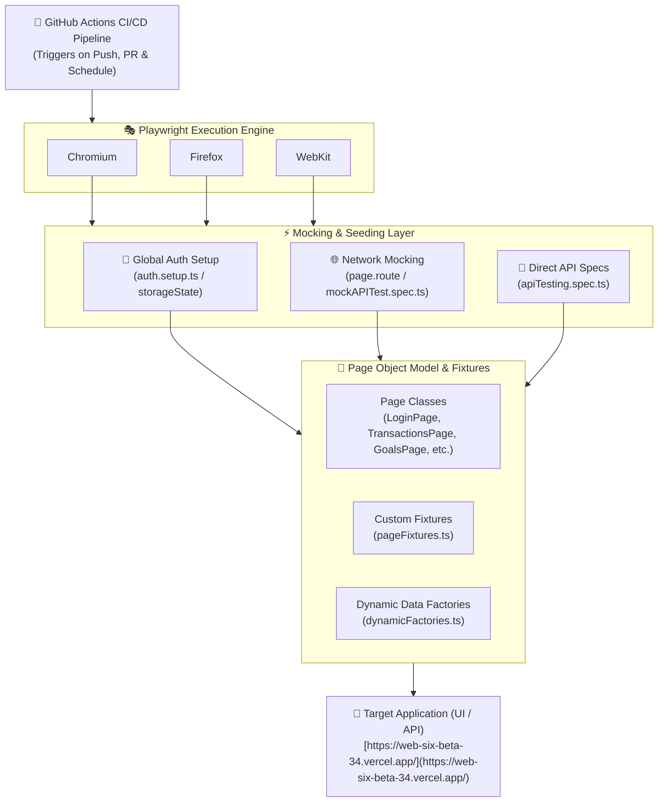

# 🎭 KashMap Playwright Automation Framework

An enterprise-grade, scalable End-to-End (E2E) and API testing framework designed for the **KashMap** financial management platform. Built on **Playwright** and **TypeScript**, this repository features Page Object Model (POM), custom Page Fixtures, dynamic data factories, state-based authentication seeding, network mocking, standalone API testing, and CI/CD integration.

---

## 🏗️ Enterprise Architecture Diagram

The diagram below illustrates the end-to-end architecture—from GitHub Actions CI/CD automation down to parallel browser execution, network mocking, API validation, and target application interaction.



```text
+-----------------------------------------------------------------------+
|                    Enterprise Test Architecture                       |
+-----------------------------------------------------------------------+
                                   |
                                   v
+-----------------------------------------------------------------------+
|                    GitHub Actions CI/CD Pipeline                      |
|                  (Triggers on Push, PR & Schedule)                    |
+----------------------------------+------------------------------------+
                                   |
                                   v
+-----------------------------------------------------------------------+
|                     Playwright Execution Engine                       |
|         (Parallel Execution across Chromium, Firefox, WebKit)         |
+-----------------+---------------------------------+-------------------+
                  |                                 |
                  v                                 v
+-----------------------------------+ +---------------------------------+
|       Network Mocking Layer       | |    API & State Seeding Layer    |
| - Route Interception (page.route) | | - Global Setup (auth.setup.ts)  |
| - Mock API Data (mockAPITest)     | | - Direct API Specs (apiTesting) |
+-----------------+-----------------+ | - Session Persistence           |
                  |                   +-----------------+---------------+
                  |                                     |
                  +-----------------+-------------------+
                                    |
                                    v
+-----------------------------------------------------------------------+
|                      Page Object Model & Fixtures                     |
| - Page Classes: LoginPage, TransactionsPage, GoalsPage, etc.          |
| - Custom Fixtures: pageFixtures.ts (Pre-instantiated POM Injection)   |
| - Dynamic Data: dynamicFactories.ts (Timestamp/Faker Payloads)        |
+-----------------------------------+-----------------------------------+
                                    |
                                    v
+-----------------------------------------------------------------------+
|                     Target Application (UI / API)                     |
|                 [https://web-six-beta-34.vercel.app/](https://web-six-beta-34.vercel.app/)                   |
+-----------------------------------------------------------------------+

```

---

## ✨ Framework Features

* **🏎️ Parallel Execution & Cross-Browser Testing:** Concurrent test runs across Chromium, Firefox, and WebKit engines for reduced feedback loops.
* **🔐 Authentication State Persistence (`storageState`):** Reusable authenticated states (`auth.setup.ts`) eliminate repetitive UI login steps across test suites.
* **💉 Custom Page Fixtures:** Extends `@playwright/test` via `fixtures/pageFixtures.ts` to automatically inject pre-instantiated Page Objects into tests, reducing boilerplate.
* **🎲 Dynamic Test Data Generators:** Factory helpers (`data/dynamicFactories.ts`) build isolated, non-colliding payloads at runtime using dynamic timestamps and object overrides.
* **🌐 API Testing & Network Interception:** Includes native API validation specs (`tests/apiTesting/`) alongside UI route mocking (`tests/mock/mockAPITest.spec.ts`) for resilient testing under deterministic conditions.
* **🧹 Teardown & Lifecycle Workflows:** Explicit setup and cleanup specs (`tests/teardown/cleanupTest.spec.ts`) maintain test database/state integrity before and after runs.
* **📊 Comprehensive Reporting:** Generates interactive HTML reports with failure screenshots, full DOM traces, and video recordings.

---

## 🛠️ Repository Structure

```text
├── data/                       # Static test datasets & dynamic factories
│   ├── data.ts                 # Central data export definitions
│   ├── dynamicFactories.ts     # Payload builders (Transactions, Investments, Goals)
│   ├── goalsData.ts            # Default Goal data structures
│   ├── investmentData.ts       # Default Investment data structures
│   ├── transactionData.ts      # Default Transaction data structures
│   └── userCredentials.ts      # Test environment user credentials
├── fixtures/
│   └── pageFixtures.ts         # Custom Playwright test fixture injecting POM instances
├── pages/                      # Page Object Model (POM) Class Definitions
│   ├── exceptionsPage.ts       # Locators/handlers for platform error dialogs
│   ├── goalsPage.ts            # Locators & actions for the Goals module
│   ├── investmentsPage.ts      # Locators & actions for the Investments module
│   ├── loginPage.ts            # Locators & actions for User Authentication
│   ├── settingsPage.ts         # Locators for User Preferences & Theme Toggling
│   ├── sideMenuPage.ts         # Navigation bar & accordion locators
│   └── transactionsPage.ts     # Locators & actions for Transactions tables & dialogs
├── tests/                      # Automated Test Specs
│   ├── apiTesting/             # Native API integration test specs
│   │   └── apiTesting.spec.ts
│   ├── mock/                   # Route interception and mock API specs
│   │   └── mockAPITest.spec.ts
│   ├── setup/                  # Global auth state generation
│   │   └── auth.setup.ts
│   ├── teardown/               # Environment cleanup workflows
│   │   └── cleanupTest.spec.ts
│   └── ui/                     # End-to-End Functional UI specs
│       ├── goalsTest.spec.ts
│       ├── investmentsTest.spec.ts
│       ├── loginTest.spec.ts
│       ├── sideMenuTest.spec.ts
│       └── transactionsTest.spec.ts
├── playwright.config.ts        # Playwright framework configuration & project matrix
├── package.json                # Project dependencies and script commands
└── tsconfig.json               # TypeScript configuration

```

---

## 🚀 Quick Start Commands

### 1. Prerequisites

Ensure you have the following installed locally:

* [Node.js](https://nodejs.org/?utm_source=gemini) (v18.0.0 or higher)
* `npm` or `yarn`

### 2. Installation

Clone the project and install all Node dependencies and Playwright browser binaries:

```bash
# Clone the repository
git clone [https://github.com/niiwazz/playwright_learn.git](https://github.com/niiwazz/playwright_learn.git)
cd playwright_learn

# Install Node dependencies
npm install

# Install Playwright browsers and OS dependencies
npx playwright install --with-deps

```

### 3. Executing Tests Locally

```bash
# Execute all tests in headless mode
npx playwright test

# Launch the interactive Playwright UI Mode
npx playwright test --ui

# Run tests with visible browser windows (Headed mode)
npx playwright test --headed

# Run UI tests only
npx playwright test tests/ui/

# Run API test specs only
npx playwright test tests/apiTesting/

# Run tests on a specific browser
npx playwright test --project=chromium

# Debug a specific spec file step-by-step
npx playwright test tests/ui/transactionsTest.spec.ts --debug

```

### 4. Docker Container Execution

Run test suites inside the official Playwright Docker container for environment parity:

```bash
docker run --rm -v $(pwd):/work -w /work [mcr.microsoft.com/playwright:v1.40.0-jammy](https://mcr.microsoft.com/playwright:v1.40.0-jammy) npx playwright test

```

### 5. Viewing Test Reports

To open the generated HTML test report with trace visualizers, run:

```bash
npx playwright show-report

```

---

## 💡 Code Design & Framework Implementation

### Custom Fixtures (`fixtures/pageFixtures.ts`)

Simplifies test code by automatically instantiating Page Classes and providing them as fixtures:

```typescript
import { test as base } from '@playwright/test';
import { LoginPage } from '../pages/loginPage';
import { TransactionsPage } from '../pages/transactionsPage';

type MyFixtures = {
  loginPage: LoginPage;
  transactionsPage: TransactionsPage;
};

export const test = base.extend<MyFixtures>({
  loginPage: async ({ page }, use) => {
    await use(new LoginPage(page));
  },
  transactionsPage: async ({ page }, use) => {
    await use(new TransactionsPage(page));
  },
});

export { expect } from '@playwright/test';

```

### Dynamic Payload Generation (`data/dynamicFactories.ts`)

Generates unique payloads with runtime timestamps to prevent duplicate key errors during concurrent test execution:

```typescript
import { VALID_EXPENSE_TRANSACTION } from './transactionData';

export const generateTransactionPayload = (override = {}) => ({
  ...VALID_EXPENSE_TRANSACTION,
  notes: `AutoTest-${Date.now()}`,
  ...override,
});

```

---

## 🤝 Guidelines

1. **POM Architecture:** All new UI pages must be implemented under `pages/` using accessible locators (`getByRole`, `getByPlaceholder`, `getByText`).
2. **Fixture Registration:** Add newly created Page Objects to `fixtures/pageFixtures.ts` so they can be injected cleanly into spec files.
3. **Data Isolation:** Use `dynamicFactories.ts` for mutating or creating entities during test runs.

```

```
